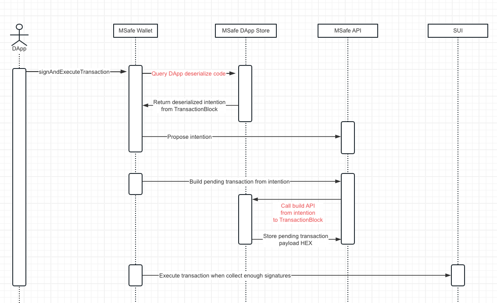

# MSafe Sui App Store

## Background

Due to Sui blockchain version limitations, multisig account can't propose multiple transactions at the same time. It's needed to be create as transaction intention first and propose transaction 1 by 1 for vote & execution.

## Overview



## Demos

https://msafe-sui-web-v3.vercel.app/

We provide a demo dApp for MSafe app store integration. please refer below GitHub repository: https://github.com/Momentum-Safe/msafe-sui-app-arbitrary-transaction

## How to contribute

- Fork the repository
- Create a new branch for your app development
- Create pull request for review

## How to develop

### Setup

- Create your app folder under `src/apps/` folder

### Create intentions

- Create your dapp intentions under `src/apps/<your app>` folder

Here is an example for transaction intention, if your dapp have multiple transaction types, you need to define 1 by 1 for each type of transaction intention.

If you are using @mysten/sui.js, you can refer to the following code:

```typescript
import { SuiClient } from '@mysten/sui.js/client';
import { TransactionBlock } from '@mysten/sui.js/transactions';

export interface ExampleIntentionData {
  foo: string;
  bar: string;
}

export class ExampleIntention extends BaseIntentionLegacy<ExampleIntentionData> {
  txType: TransactionType.Other;

  txSubType: 'Example';

  constructor(public readonly data: ExampleIntentionData) {
    super(data);
  }

  async build(input: { suiClient: SuiClient; account: WalletAccount }): Promise<TransactionBlock> {
    const { suiClient, account } = input;
    ...
    return txb;
  }

  static fromData(data: ExampleIntentionData) {
    return new ExampleIntention(data);
  }
}
```

If you are using @mysten/sui, you can refer to the following code:

```typescript
import { SuiClient } from '@mysten/sui/client';
import { Transaction } from '@mysten/sui/transactions';

export interface ExampleIntentionData {
  foo: string;
  bar: string;
}

export class ExampleIntention extends BaseIntention<ExampleIntentionData> {
  txType: TransactionType.Other;

  txSubType: 'Example';

  constructor(public readonly data: ExampleIntentionData) {
    super(data);
  }

  async build(input: { suiClient: SuiClient; account: WalletAccount }): Promise<Transaction> {
    const { suiClient, account } = input;
    ...
    return txb;
  }

  static fromData(data: ExampleIntentionData) {
    return new ExampleIntention(data);
  }
}
```

Each intention should have one data structure to store transaction information for future build.
This structure can be defined according to your own business logic, it can be any type of data, (should be JSON serializable)

Transaction intention implement mainly one API `build(): Promise<TransactionBlock>` which will build Sui transaction block from your defined business data.

### Create helper

- Create helper ts at `src/apps/<your app>/intention.ts`

Here is an example of intention.ts file

```typescript
export type CoreIntention = CoinTransferIntention | ObjectTransferIntention;

export type CoreIntentionData = CoinTransferIntentionData | ObjectTransferIntentionData;

export class CoreHelper implements IAppHelperInternalLegacy<CoreIntention, CoreIntentionData> {
  application: string;

  constructor() {
    this.application = 'msafe-core';
  }

  deserialize(): CoreIntention {
    throw new Error('MSafe core transaction intention should be build from API');
  }

  async build(input: {
    intentionData: CoreIntentionData;
    txType: TransactionType;
    txSubType: string;
    suiClient: SuiClient;
    account: WalletAccount;
  }): Promise<TransactionBlock> {
    const { suiClient, account } = input;
    let intention: CoreIntention;
    switch (input.txSubType) {
      case 'coin-transfer':
        intention = CoinTransferIntention.fromData(input.intentionData as CoinTransferIntentionData);
        break;
      case 'object-transfer':
        intention = ObjectTransferIntention.fromData(input.intentionData as ObjectTransferIntentionData);
        break;
      default:
        throw new Error('not implemented');
    }
    return intention.build({ suiClient, account });
  }
}
```

The helper is responsible for convert a transaction block to your own transaction intention business data. this is call by SuiWallet standard API `sui:signTransactionBlock` feature.

### Write test for your business logic

- Create your test at `test/<your app>.test.ts`

You can follow be example to write test

```typescript
import { TransactionType } from '@msafe/sui3-utils';

import { CoinTransferIntention, CoinTransferIntentionData } from '@/apps/msafe-core/coin-transfer';
import { appHelpers } from '@/index';

import { Account, Client } from './config';

describe('MSafe Core Wallet', () => {
  it('Core transaction build', async () => {
    const appHelper = appHelpers.getAppHelper('msafe-core');

    expect(appHelper.application).toBe('msafe-core');

    const res = await appHelper.build({
      txType: TransactionType.Assets,
      txSubType: 'coin-transfer',
      suiClient: Client,
      account: Account,
      intentionData: {
        amount: '1000',
        coinType: '0x2::sui::SUI',
        recipient: '123',
      } as CoinTransferIntentionData,
    });
    expect(res.blockData.version).toBe(1);
    expect(res.blockData.sender).toBe('0x0df172b18d30935ad68b2f9d6180e5adcf8edfd7df874852817002e6eccada66');
  });

  it('Test intention serialization', () => {
    const intention = CoinTransferIntention.fromData({
      recipient: 'a',
      coinType: 'b',
      amount: '100',
    });

    expect(intention.serialize()).toBe('{"amount":"100","coinType":"b","recipient":"a"}');
  });
});
```

### App custom parameters

- You can pass custom parameters into the `appContext` parameter of the Helper.deserialize method. 

```typescript
deserialize(input: {
    transaction: Transaction;
    chain: IdentifierString;
    network: SuiNetworks;
    suiClient: SuiClient;
    account: WalletAccount;
    **appContext?: any;**
  }): Promise<{
    txType: TransactionType;
    txSubType: string;
    intentionData: T;
  }>;
```

- When implementing your app's `Helper.deserialize`, you can write your business logic based on the custom parameters you've passed in.

- For reference, you can review the implementation logic demo code below.

```typescript
export class DemoHelper implements IAppHelperInternal<DemoIntentionData> {

...

async deserialize(input: {
    transaction: Transaction;
    chain: IdentifierString;
    network: SuiNetworks;
    suiClient: SuiClient;
    account: WalletAccount;
    appContext?: any;
  }): Promise<{ txType: TransactionType; txSubType: string; intentionData: CetusIntentionData }> {
    const { txbParams, action } = input.appContext;

    return {
      txType: TransactionType.Other,
      txSubType: action,
      intentionData: {
        txbParams: { ...txbParams },
        action,
      },
    };
  }

... 

```

### Register your app helper

- Add your app helper to file `src/index.ts`

```typescript
export const appHelpers = new MSafeApps([new CoreHelper(), <your app helper instance here>]);
```

### Create pull request for submit

Once you finish development, you can create a PR to submit your changes.

## Integrate MSafe wallet with your app

The last step is to integrate MSafe wallet with your application

- Run command `yarn add @msafe/sui-wallet` to add MSafe wallet package to your project
- Add below code to your application, basically it should be added to your `main.tsx` file

```typescript
import { MSafeWallet } from '@msafe/sui-wallet';
import { registerWallet } from '@mysten/wallet-standard';

registerWallet(new MSafeWallet('<your app name>'));
```

### Next Step

Once the development mentioned above is complete, MSafe team will assist in verifying the integration. Feedback will be provided to your team upon completion of the verification process.
