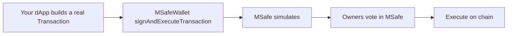
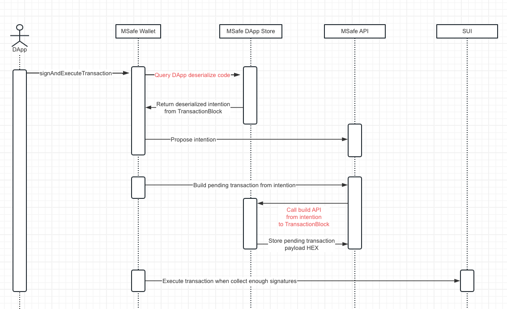

# MSafe Sui App Store

<p align="center">
  
  
  
</p>

<table>
  <tr>
    <td align="center">

### Integration is now the same as any Sui wallet

You **do not write a helper**. You **do not wait for this package to publish**. You build a real `Transaction` in your dApp — the same object you already send to Slush — and submit it with `@msafe/sui-wallet`.

Writing a helper, forking `src/apps/**`, or opening a PR here will **not** list your dApp.

**New listing → [What you gain](#what-you-gain-in-this-version)** then [Current integration](#current-integration)  
**Already started a helper → [How to change your dApp](#how-to-change-your-dapp)**  
**Have an agent do the edit → [Prompt for your coding agent](#prompt-for-your-coding-agent)**

</td>
  </tr>
</table>

> [!TIP]
> **This version’s point:** drop the adapter. If your dApp can sign with a normal wallet, it can sign with MSafe. Listing is a store card (name, icon, URL), usually done in a day — not a week of helper review and an MSafe release.

---

## What you gain in this version

The old path existed because a queued multisig tx had to be **rebuilt** later, so every protocol needed an MSafe-owned helper. That is no longer how new apps enter the store. You submit the finished transaction once; MSafe simulates, votes, and executes **that** PTB.

| | ~~Before (helper)~~ | **Now (wallet `Transaction`)** |
| --- | --- | --- |
| What you write | Intention class + `deserialize` / `build` + tests + PR in **this** repo | The PTB you already build for other wallets |
| Extra dependency | `@msafe/sui-app-store` + `appContext` | `@msafe/sui-wallet` only |
| Who ships your adapter | MSafe reviews, merges, and **publishes a new app-store version** | **Nobody.** There is no adapter. |
| Blocked on | Our sprint, this repo’s CI, npm publish | Your own PTB being correct |
| Mysten / protocol SDK upgrades | Helper in this repo had to follow; you waited on us | You upgrade **your** dApp; we are not in the loop |
| Three new protocols at once | Three helper PRs, serialized on our side | Three teams in parallel; we only add three cards |

**You delete work, you do not add a new integration style.**

- No `BaseIntention` / `YourHelper` / `src/apps/<name>`
- No empty `new Transaction()` + `appContext` so we can rebuild later
- No “please merge our helper” email
- No holding a launch for `@msafe/sui-app-store@x.y.z`

Users still get the full multisig flow (simulate → approve → execute). New apps use a generic transaction view instead of a custom swap card. That is the trade for **not** being on our release calendar.

> [!CAUTION]
> **DEPRECATED:** `BaseIntention`, `IAppHelperInternal`, `src/apps/<your-app>`, `appContext`, and “fork this repo + wait for our release” are retired for **all new listings**.
>
> New helper PRs will **not** be merged. Waiting for `@msafe/sui-app-store` to publish will **not** unblock you.

> [!IMPORTANT]
> **Do this instead:** assemble the PTB yourself → `registerWallet(new MSafeWallet('your-app-name', rpcUrl, network))` → `signAndExecuteTransaction({ transaction: tx })`. Ask MSafe only for a store **card** (name, icon, URL).

---

## Prompt for your coding agent

Copy the block below into Cursor, Claude, Codex, or any repo agent. It will read this README and apply the migration in **your dApp** (not in `msafe-sui-app-store`).

```text
You are migrating this dApp onto the current MSafe store integration.

1. Read this README first and treat it as the only spec:
   https://github.com/Momentum-Safe/msafe-sui-app-store/blob/main/README.md
   If the user attached or opened a local copy of that README, use the local copy.
   Follow “How to change your dApp” and “Current integration”.
   Ignore the collapsed “DEPRECATED archive”. Do not implement a helper.

2. Goal: MSafe is a normal Sui wallet. We submit a fully assembled Transaction.
   We do NOT write BaseIntention / IAppHelperInternal / src/apps helpers.
   We do NOT open a PR against Momentum-Safe/msafe-sui-app-store.
   We do NOT wait for @msafe/sui-app-store to publish.

3. Search the repo for and remove MSafe-helper-only code:
   - imports of @msafe/sui-app-store, appHelpers, BaseIntention, IAppHelperInternal
   - appContext passed into signTransaction / signAndExecuteTransaction / signTransactionBlock
   - empty `new Transaction()` (or TransactionBlock) created only so a helper can build() later
   - local forks or copies of msafe-sui-app-store helpers
   Keep protocol SDKs and the real PTB those SDKs already produce.

4. Implement the wallet path:
   - Add @msafe/sui-wallet if missing.
   - Register once at app startup:
     registerWallet(new MSafeWallet('<stable-app-name>', rpcUrl, 'sui:mainnet' | 'sui:testnet'));
     Use a stable app name (same string we will put on the MSafe store card).
   - Connect with @mysten/dapp-kit or wallet-standard, same as other wallets.
   - Every MSafe sign call must pass a Transaction with commands.length > 0.
   - tx.setSender(...) must be the connected MSafe multisig address.
   - Do not pass appContext.
   - Prefer signTransaction / signAndExecuteTransaction. Do not expect a digest:
     signAndExecuteTransaction only proposes; owners vote and execute inside MSafe.

5. Remove @msafe/sui-app-store from package.json / lockfile if nothing else needs it.

6. Do not edit files under a clone of msafe-sui-app-store to “register” us.
   After code lands, tell the human what to send MSafe for the store card:
   app name, icon, production URL.

7. When done, list changed files and remaining checklist items from the README.
```

After the agent finishes: send MSafe the app name, icon, and production URL so the store card can go up.

---

## How to change your dApp

Use this section if your team followed the old README: created an intention class, a helper, `appContext`, or a PR against this repo.

### Stop / start

| Stop (deprecated) | Start (required) |
| --- | --- |
| ~~`yarn add @msafe/sui-app-store`~~ / import `appHelpers` | Delete the dependency. Your dApp must not import this package. |
| ~~`src/apps/<your-app>` intention + helper~~ | Delete the fork / local helper. MSafe will not review or ship it. |
| ~~Open a PR to register `new YourHelper()` in `src/index.ts`~~ | Close the PR. Listing is a store card, not a helper publish. |
| ~~`signTransaction({ transaction: new Transaction(), appContext })`~~ | Pass a **fully built** `Transaction` (`commands.length > 0`). **No `appContext`.** |
| ~~Wait for MSafe to release `@msafe/sui-app-store`~~ | Ship your dApp. Then send name / icon / URL for the card. |
| ~~`new MSafeWallet('app')` only~~ | `new MSafeWallet('your-app-name', rpcUrl, 'sui:mainnet')` |

### Before → after

**1. Wallet registration**

```ts
// DEPRECATED — incomplete constructor, often paired with a helper name
registerWallet(new MSafeWallet('your-app-name'));
```

```ts
// REQUIRED
import { MSafeWallet } from '@msafe/sui-wallet';
import { registerWallet } from '@mysten/wallet-standard';

registerWallet(new MSafeWallet('your-app-name', rpcUrl, 'sui:mainnet'));
```

Use the **same** `your-app-name` in history and in the store card.

**2. Submit**

```ts
// DEPRECATED — empty PTB + helper payload. Unregistered apps are rejected.
await signAndExecuteTransaction({
  transaction: new Transaction(),
  appContext: { action: 'swap', txbParams },
});
```

```ts
// REQUIRED — same Transaction you would send to Slush / any wallet
import { Transaction } from '@mysten/sui/transactions';

const tx = new Transaction();
tx.setSender(multisigAddress); // connected MSafe account
// ...real moveCall / transfer / SDK calls — commands.length must be > 0

await dAppKit.signAndExecuteTransaction({ transaction: tx });
// Do not pass appContext.
```

**3. Remove helper-only code**

Search the dApp and delete:

- `from '@msafe/sui-app-store'`
- `appContext`
- `BaseIntention` / `YourHelper` / `deserialize` / `intentionData`
- empty `new Transaction()` built only so the helper can `build()` later

Keep your protocol SDK (Cetus SDK, NAVI SDK, your own `moveCall`s). Those already produce a `Transaction`. Submit **that** object.

### Migration checklist

- [ ] Remove `@msafe/sui-app-store` from `package.json`
- [ ] Register `MSafeWallet` with **name + RPC URL + network**
- [ ] Connect via `@mysten/dapp-kit` (or wallet-standard) as you do for other wallets
- [ ] Every MSafe sign path sends a PTB with **at least one command**
- [ ] No `appContext` on `signTransaction` / `signAndExecuteTransaction`
- [ ] `tx.setSender` is the **multisig** address (the connected MSafe account)
- [ ] Close any helper PR against this repository
- [ ] Send MSafe: app name, icon, production URL — for the store card only

`signAndExecuteTransaction` **proposes** to the multisig queue. It does **not** return an on-chain digest. Owners vote and execute in MSafe.

Empty `new Transaction()` from an unregistered app is rejected:

> Empty transaction. Unregistered apps must pass a fully assembled Transaction (`commands.length > 0`). Do not send `new Transaction()`.

---

## Current integration


```mermaid
flowchart LR
  A[Your dApp builds a real Transaction] --> B["MSafeWallet signAndExecuteTransaction"]
  B --> C[MSafe simulates]
  C --> D[Owners vote in MSafe]
  D --> E[Execute on chain]
```

Inside the MSafe store iframe, treat MSafe as a normal wallet. You own the PTB. MSafe owns simulate → vote → execute. New apps use the generic payload view (simulation + raw transaction), not a custom “swap / deposit” card.

### 1. Register the wallet

```ts
import { MSafeWallet } from '@msafe/sui-wallet';
import { registerWallet } from '@mysten/wallet-standard';

registerWallet(new MSafeWallet('your-app-name', rpcUrl, 'sui:mainnet'));
```

Call this once at startup (`main.tsx`). Use `MSafeWallet.inMSafeWallet()` if the page should behave differently inside the iframe versus standalone.

### 2. Submit the transaction

```ts
await dAppKit.signAndExecuteTransaction({ transaction: tx });
```

| Rule | Detail |
| --- | --- |
| Real PTB | `tx.getData().commands.length > 0` |
| Sender | Connected MSafe **multisig** |
| No helper | Do not import this package. Do not pass `appContext`. |
| Encoding | Mysten V2 `Transaction` / `toJSON()`. Do not use V1 `serialize()`. |

| API | Behavior |
| --- | --- |
| `signTransaction({ transaction })` | Propose. Preferred. |
| `signAndExecuteTransaction({ transaction })` | Same propose path. **No digest** in the result. |
| `signTransactionBlock` / `signAndExecuteTransactionBlock` | Legacy aliases. |

The store iframe accepts **one** in-flight proposal. If the multisig already has a pending transaction or future intentions, a new submit is rejected until that queue is cleared.

### 3. List in the store

Listing is a **card**: name, icon, URL. MSafe adds `id` / `image` / `dappLink` on the web app. There is no adapter review and no `@msafe/sui-app-store` release on the critical path.

### Reference

- Wallet SDK: https://github.com/Momentum-Safe/msafe-sui-wallet
- Sample dApp: https://github.com/Momentum-Safe/msafe-sui-app-arbitrary-transaction — follow the **wallet `Transaction`** path, not old `appContext` commits
- Live sample: https://sui-ptx.m-safe.io/

---

## Already-listed apps with a helper

Cetus, NAVI, MMT, mpay, `msafe-core`, `msafe-plain-tx`, and other **already registered** helpers may keep empty PTB + `appContext` until they migrate.

- Do not add helpers for **new** products or new protocols.
- New features on a listed brand should still use [How to change your dApp](#how-to-change-your-dapp) when you can.

This package remains a **compatibility library** only. MSafe may still publish it to patch an existing helper. That is not how new apps go live.

---

<details>
<summary><strong>⛔ DEPRECATED archive — old helper guide (do not follow)</strong></summary>

> [!CAUTION]
> Everything below is the previous contribution guide. It is **deprecated** and kept only so reviewers can see what was retired. **Do not copy it.** Jump back to [How to change your dApp](#how-to-change-your-dapp).

### ~~Background~~

~~Due to Sui blockchain version limitations, multisig account can't propose multiple transactions at the same time. It's needed to be create as transaction intention first and propose transaction 1 by 1 for vote & execution.~~

### ~~Overview~~

~~~~

### ~~Demos~~

~~We provide a demo dApp for MSafe app store integration. please refer below GitHub repository: https://github.com/Momentum-Safe/msafe-sui-app-arbitrary-transaction~~

~~In this demo, we implement a dApp that allows users to execute arbitrary transaction on Sui.~~

~~You can see how to implement with `@msafe/sui-app-store` in this demo.~~

~~Including:~~

- ~~Initiate MSafe Wallet~~
- ~~Connect to MSafe Wallet using `@mysten/dapp-kit`~~
- ~~Sign transaction with MSafe Wallet (also using `@msafe/dapp-kit`)~~

~~The main logic is implemented in `src/App.tsx`~~

~~Demo dApp: https://sui-ptx.m-safe.io/~~

### ~~How to contribute~~

- ~~Fork the repository~~
- ~~Create a new branch for your app development~~
- ~~Create pull request for review~~

### ~~How to develop~~

#### ~~Summary~~

~~There are two ways to integrate with the MSafe Sui App store:~~

1. ~~When dapp call signTransaction method, directly pass in the assembled Transaction (Transaction Block), and the user can then complete the subsequent transaction process.~~
2. ~~Through the create helper method (see below)~~

#### ~~Setup~~

- ~~Create your app folder under `src/apps/` folder~~

#### ~~Create intentions~~

- ~~Create your dapp intentions under `src/apps/<your app>` folder~~

~~Here is an example for transaction intention, if your dapp have multiple transaction types, you need to define 1 by 1 for each type of transaction intention.~~

~~If you are using @mysten/sui.js, you can refer to the following code:~~

~~Historical example — do not copy:~~

```typescript
import { SuiClient } from '@mysten/sui.js/client';
import { TransactionBlock } from '@mysten/sui.js/transactions';

export interface ExampleIntentionData {
  foo: string;
  bar: string;
}

export class ExampleIntention extends BaseIntentionLegacy<ExampleIntentionData> {
  txType: TransactionType.Other;

  txSubType: 'Example';

  constructor(public readonly data: ExampleIntentionData) {
    super(data);
  }

  async build(input: { suiClient: SuiClient; account: WalletAccount }): Promise<TransactionBlock> {
    const { suiClient, account } = input;
    ...
    return txb;
  }

  static fromData(data: ExampleIntentionData) {
    return new ExampleIntention(data);
  }
}
```

~~If you are using @mysten/sui, you can refer to the following code:~~

```typescript
import { SuiClient } from '@mysten/sui/client';
import { Transaction } from '@mysten/sui/transactions';

export interface ExampleIntentionData {
  foo: string;
  bar: string;
}

export class ExampleIntention extends BaseIntention<ExampleIntentionData> {
  txType: TransactionType.Other;

  txSubType: 'Example';

  constructor(public readonly data: ExampleIntentionData) {
    super(data);
  }

  async build(input: { suiClient: SuiClient; account: WalletAccount }): Promise<Transaction> {
    const { suiClient, account } = input;
    ...
    return txb;
  }

  static fromData(data: ExampleIntentionData) {
    return new ExampleIntention(data);
  }
}
```

~~Each intention should have one data structure to store transaction information for future build.~~
~~This structure can be defined according to your own business logic, it can be any type of data, (should be JSON serializable)~~

~~Transaction intention implement mainly one API `build(): Promise<TransactionBlock>` which will build Sui transaction block from your defined business data.~~

#### ~~Create helper~~

- ~~Create helper ts at `src/apps/<your app>/intention.ts`~~

```typescript
export type CoreIntention = CoinTransferIntention | ObjectTransferIntention;

export type CoreIntentionData = CoinTransferIntentionData | ObjectTransferIntentionData;

export class CoreHelper implements IAppHelperInternalLegacy<CoreIntention, CoreIntentionData> {
  application: string;

  constructor() {
    this.application = 'msafe-core';
  }

  deserialize(): CoreIntention {
    throw new Error('MSafe core transaction intention should be build from API');
  }

  async build(input: {
    intentionData: CoreIntentionData;
    txType: TransactionType;
    txSubType: string;
    suiClient: SuiClient;
    account: WalletAccount;
  }): Promise<TransactionBlock> {
    const { suiClient, account } = input;
    let intention: CoreIntention;
    switch (input.txSubType) {
      case 'coin-transfer':
        intention = CoinTransferIntention.fromData(input.intentionData as CoinTransferIntentionData);
        break;
      case 'object-transfer':
        intention = ObjectTransferIntention.fromData(input.intentionData as ObjectTransferIntentionData);
        break;
      default:
        throw new Error('not implemented');
    }
    return intention.build({ suiClient, account });
  }
}
```

~~The helper is responsible for convert a transaction block to your own transaction intention business data. this is call by SuiWallet standard API `sui:signTransactionBlock` feature.~~

#### ~~Write test for your business logic~~

- ~~Create your test at `test/<your app>.test.ts`~~

```typescript
import { TransactionType } from '@msafe/sui3-utils';

import { CoinTransferIntention, CoinTransferIntentionData } from '@/apps/msafe-core/coin-transfer';
import { appHelpers } from '@/index';

import { Account, Client } from './config';

describe('MSafe Core Wallet', () => {
  it('Core transaction build', async () => {
    const appHelper = appHelpers.getAppHelper('msafe-core');

    expect(appHelper.application).toBe('msafe-core');

    const res = await appHelper.build({
      txType: TransactionType.Assets,
      txSubType: 'coin-transfer',
      suiClient: Client,
      account: Account,
      intentionData: {
        amount: '1000',
        coinType: '0x2::sui::SUI',
        recipient: '123',
      } as CoinTransferIntentionData,
    });
    expect(res.blockData.version).toBe(1);
    expect(res.blockData.sender).toBe('0x0df172b18d30935ad68b2f9d6180e5adcf8edfd7df874852817002e6eccada66');
  });

  it('Test intention serialization', () => {
    const intention = CoinTransferIntention.fromData({
      recipient: 'a',
      coinType: 'b',
      amount: '100',
    });

    expect(intention.serialize()).toBe('{"amount":"100","coinType":"b","recipient":"a"}');
  });
});
```

#### ~~App custom parameters~~

- ~~You can pass custom parameters into the `appContext` parameter of the Helper.deserialize method.~~

```typescript
deserialize(input: {
    transaction: Transaction;
    chain: IdentifierString;
    network: SuiNetworks;
    suiClient: SuiClient;
    account: WalletAccount;
    appContext?: any;
  }): Promise<{
    txType: TransactionType;
    txSubType: string;
    intentionData: T;
  }>;
```

- ~~When implementing your app's `Helper.deserialize`, you can write your business logic based on the custom parameters you've passed in.~~

```typescript
export class DemoHelper implements IAppHelperInternal<DemoIntentionData> {

...

async deserialize(input: {
    transaction: Transaction;
    chain: IdentifierString;
    network: SuiNetworks;
    suiClient: SuiClient;
    account: WalletAccount;
    appContext?: any;
  }): Promise<{ txType: TransactionType; txSubType: string; intentionData: CetusIntentionData }> {
    const { txbParams, action } = input.appContext;

    return {
      txType: TransactionType.Other,
      txSubType: action,
      intentionData: {
        txbParams: { ...txbParams },
        action,
      },
    };
  }

...

}
```

#### ~~Register your app helper~~

- ~~Add your app helper to file `src/index.ts`~~

```typescript
export const appHelpers = new MSafeApps([new CoreHelper(), <your app helper instance here>]);
```

#### ~~Test your integration with our test framework `TestSuite`~~

- ~~before create pull request, you should test your helper with test suite, add at least one test case before creating the PR.~~

```typescript
import { TestSuite, TestSuiteLegacy } from './TestSuite';

describe('Main flow', () => {
  const testWallet: WalletAccount = {
    address: 'YOUR_TEST_WALLET_ADDRESS',
    publicKey: HexToUint8Array('YOUR_TEST_WALLET_PUBLIC_KEY'),
    chains: [SUI_MAINNET_CHAIN],
    features: [],
  };

  let ts: TestSuite<YourIntentionData>;
  let ts: TestSuiteLegacy<YourIntentionData>;

  beforeEach(() => {
    ts = new TestSuite(testWallet, 'sui:mainnet', new YourHelper());
  });

  describe('overall flow', () => {
    it('overall flow', async () => {
      const appTxb = new TransactionBlock();
      await ts.signAndSubmitTransaction({ txb: appTxb, appContext: {
        // ... your app context here, will be passed to your helper.deserialize method
      } });
      const finalizedTxb = await ts.voteAndExecuteIntention();

      expect(finalizedTxb).toBeDefined();
    });
  });
});
```

~~You can refer to `test/core.test.ts` for more details implementation.~~

#### ~~Create pull request for submit~~

~~Once you finish development, you can create a PR to submit your changes.~~

### ~~Integrate MSafe wallet with your app~~

- ~~Run command `yarn add @msafe/sui-wallet` to add MSafe wallet package to your project~~
- ~~Add below code to your application, basically it should be added to your `main.tsx` file~~

```typescript
import { MSafeWallet } from '@msafe/sui-wallet';
import { registerWallet } from '@mysten/wallet-standard';

registerWallet(new MSafeWallet('<your app name>'));
```

#### ~~Next Step~~

~~Once the development mentioned above is complete, MSafe team will assist in verifying the integration. Feedback will be provided to your team upon completion of the verification process.~~

</details>
